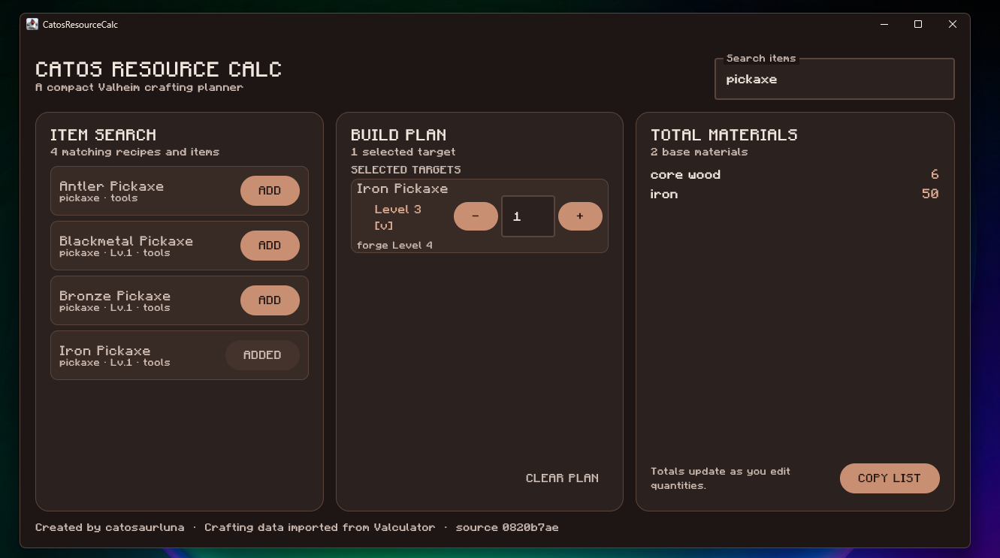

# CatosResourceCalc

A compact, offline Valheim crafting-material calculator for Windows. Search for an item, add it to your build plan, choose its recipe level, and get a combined shopping list of the materials you need.



## Features

- Warm mocha desktop UI with the bundled Minecraft font
- Three-column layout: item search, build plan, and total materials
- Search results collapse same-name recipe levels into one item
- Level selector for upgradeable items such as pickaxes and weapons
- Quantity controls with direct positive-integer validation
- Minus at quantity one removes an item from the plan
- Recursive expansion of craftable ingredients into base materials
- Crafting-station and workstation level details for selected recipes
- Stable `Materials Needed` clipboard output for sharing with other players
- Fully offline at runtime using a versioned bundled data snapshot

## Quick start

Requirements:

- Windows 10 or newer
- Java 25 (the project uses the Gradle toolchain configured in `build.gradle.kts`)

From PowerShell:

```powershell
.\gradlew.bat run
```

To run the verification suite and build the project:

```powershell
.\gradlew.bat test build
```

The application does not need Node, Yarn, Git, or the Valculator checkout after the generated data snapshot has been bundled.

## Data source

CatosResourceCalc is a separate application. It does not reuse Valculator's website, React UI, routing, or hosting code. The crafting data is imported from Valculator's TypeScript data package, converted into a deterministic schema-v1 JSON snapshot, and bundled into this repository at:

```text
src/main/resources/data/valheim-data.json
```

The snapshot records the upstream repository URL and exact source commit. The checked-in snapshot is what the application uses at runtime; no network access or scraping occurs.

If the sibling checkout at `..\valculator` is available, regenerate the snapshot with:

```powershell
.\gradlew.bat exportValculatorData
```

The exporter validates IDs, material references, quantities, and deterministic output before writing the snapshot. A custom checkout can be supplied with `-PvalculatorSource=C:\path\to\valculator`.

## Project structure

```text
src/main/kotlin/com/cato/resourcecalc/
  calculator/       Pure Kotlin recursive calculation engine
  data/             JSON models, loader, validator, and search index
  platform/         Windows DWM title-bar integration
  ui/               Mocha theme and typography
tools/              Valculator-to-JSON data exporter
DOCS/devplan.md     Implementation plan and release checklist
```

The calculation core has no Compose, filesystem, network, or Valheim-installation dependency, which keeps the data and business rules testable independently from the desktop UI.

## Attribution

The application is authored by **catosaurluna**. Crafting data is imported from [Valculator](https://github.com/charlotte-hues/valculator), with the source commit preserved in the generated snapshot. The `Minecraft.otf` font is bundled as a standalone project asset and is publicly available for redistribution.

## Development status

The core calculator and functional MVP UI are implemented. Remaining release work is focused on final attribution files, packaging a standalone Windows artifact, clean-machine testing, and release polish.
